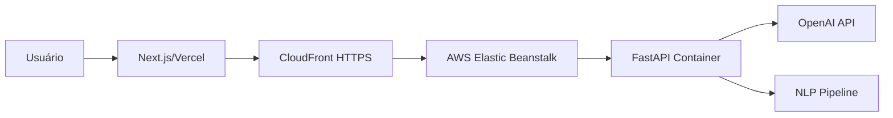

# InboxIQ

> Triagem inteligente de emails com classificação automática e respostas sugeridas em tempo real

<div align="center">


[Demo](https://inboxiq.vercel.app) · [Documentação API](https://d3sxxc62guaqxd.cloudfront.net/docs)

</div>

---

## 📋 Sobre o Projeto

O **InboxIQ** é um MVP que demonstra capacidades avançadas de NLP e integração com IA para triagem automatizada de emails. O sistema classifica emails em categorias produtivas/improdutivas e gera respostas contextualizadas prontas para envio.

### ✨ Principais Recursos

- 🎯 **Classificação Inteligente**: Identifica emails que demandam ação vs. comunicações informativas
- 🤖 **Respostas Automatizadas**: Gera sugestões de resposta em português brasileiro
- 📧 **Integração Gmail**: Conecta diretamente com sua conta via OAuth 2.0
- 📄 **Múltiplos Formatos**: Aceita texto, arquivos .txt e PDFs
- 🔒 **Segurança**: HTTPS end-to-end com correlação de requisições
- ⚡ **Performance**: Rate limiting e processamento assíncrono

---

## 🏗️ Arquitetura



### Stack Tecnológica

#### Frontend
- **Next.js 15** (App Router) - Framework React moderno
- **shadcn/ui** - Componentes reutilizáveis
- **Tailwind CSS** - Estilização utilitária
- **Gmail API** - Integração OAuth client-side

#### Backend
- **FastAPI** - Framework ASGI de alta performance
- **Gunicorn + Uvicorn** - Servidor ASGI em produção
- **OpenAI SDK** - Classificação e geração via GPT
- **pypdf** - Extração de texto de PDFs
- **simplemma** - Lematização multilíngue
- **stopwordsiso** - Remoção de stopwords (pt/en)

#### Infraestrutura
- **Vercel** - Hospedagem frontend
- **AWS Elastic Beanstalk** - Container Docker do backend
- **CloudFront** - CDN e terminação SSL/TLS
- **Docker** - Containerização da aplicação

---

## 🚀 Getting Started

### Pré-requisitos

- Node.js 18+
- Python 3.13+
- Conta OpenAI (API key)
- Conta Google Cloud (para integração Gmail)

### Instalação Local

#### Backend

```bash
cd backend

# Criar ambiente virtual
python -m venv venv
source venv/bin/activate  # Linux/Mac
# ou: venv\Scripts\activate  # Windows

# Instalar dependências
pip install -r requirements.txt

# Configurar variáveis de ambiente
cp .env.example .env
# Editar .env com suas credenciais

# Executar servidor de desenvolvimento
uvicorn app.main:app --reload --port 8000
```

#### Frontend

```bash
cd frontend

# Instalar dependências
npm install

# Configurar variáveis de ambiente
cp .env.local.example .env.local
# Editar .env.local

# Executar em modo desenvolvimento
npm run dev
```

Acesse `http://localhost:3000`

---

## ⚙️ Variáveis de Ambiente

### Backend (.env)

```env
# OpenAI
OPENAI_API_KEY=sk-...
OPENAI_MODEL=gpt-4o-mini

# CORS
ALLOWED_ORIGINS=http://localhost:3000,https://yourdomain.com

# Server
PORT=8000
WEB_CONCURRENCY=4

# Logging
LOG_LEVEL=INFO
LOG_JSON=true

# Upload
EMAIL_MAX_UPLOAD_BYTES=10485760  # 10MB
EMAIL_UPLOAD_CHUNK_SIZE=1048576  # 1MB

# Gunicorn
GUNICORN_TIMEOUT=300
GUNICORN_GRACEFUL_TIMEOUT=30
GUNICORN_MAX_REQUESTS=1000
GUNICORN_MAX_REQUESTS_JITTER=100
```

### Frontend (.env.local)

```env
NEXT_PUBLIC_API_URL=https://d3sxxc62guaqxd.cloudfront.net
NEXT_PUBLIC_GOOGLE_CLIENT_ID=your-client-id.apps.googleusercontent.com
```

---

## 📡 API Reference

### Endpoints Principais

#### Health Check
```http
GET /health
```

**Resposta:**
```json
{
  "status": "ok"
}
```

#### Análise de Texto
```http
POST /emails/analyze
Content-Type: application/json

{
  "text": "Conteúdo do email aqui..."
}
```

**Resposta:**
```json
{
  "success": true,
  "message": "Email analisado com sucesso",
  "data": {
    "category": "Produtivo",
    "suggested_reply": "Assunto: Re: Sua solicitação\n\nOlá,\n\n...",
    "confidence": 0.92
  }
}
```

#### Análise de Arquivo
```http
POST /emails/analyze-file
Content-Type: multipart/form-data

file: [arquivo.pdf ou arquivo.txt]
```

**Documentação completa:** [Swagger UI](https://d3sxxc62guaqxd.cloudfront.net/docs)

---

## 🧠 Pipeline de Processamento NLP

O InboxIQ implementa um pipeline sofisticado de processamento de linguagem natural:

```
1. Normalização de texto
   ├─ Remoção de espaços extras
   ├─ Detecção de URLs, emails, números
   └─ Substituição por tokens especiais

2. Detecção de idioma
   └─ Heurística baseada em stopwords (pt/en)

3. Tokenização
   └─ Regex otimizado para separação de palavras

4. Remoção de stopwords
   └─ Filtros específicos por idioma detectado

5. Lematização
   ├─ simplemma com fallback cross-language
   └─ Redução a formas canônicas

6. Extração de keywords
   └─ Top 25 termos mais relevantes

7. Classificação via OpenAI
   ├─ Prompt engineering com contexto
   ├─ Parse estruturado (Pydantic)
   └─ Output guard para consistência
```

---

## 🎨 Componentes do Frontend

### Fluxo de Análise

```tsx
EmailAnalyzer
├─ InputModeSelector (texto/arquivo/Gmail)
├─ GmailPickerDialog (seleção de email)
├─ FileUploader (drag-n-drop)
├─ AnalyzeButton
└─ ResponseCard
    ├─ CategoryBadge
    ├─ TypingEffect
    └─ ActionButtons
        ├─ CopyButton
        └─ GmailSendDialog
```

### Principais Bibliotecas UI

- **shadcn/ui**: Componentes acessíveis e customizáveis
- **Lucide Icons**: Ícones modernos e consistentes
- **Sonner**: Toast notifications elegantes

---

## 🔒 Segurança e Boas Práticas

### Correlation ID
Toda requisição recebe um ID único para rastreabilidade:
```http
X-Correlation-Id: 550e8400-e29b-41d4-a716-446655440000
```

### Rate Limiting
- **15 requisições/minuto** por IP
- Resposta 429 com envelope padronizado

### Logging Estruturado
Logs em formato JSON para observabilidade:
```json
{
  "ts": "2026-01-17T12:34:56.789Z",
  "level": "INFO",
  "correlation_id": "uuid-here",
  "event": "request_end",
  "method": "POST",
  "path": "/emails/analyze",
  "status_code": 200,
  "duration_ms": 1234
}
```

### Tratamento de Erros
Todos os erros seguem o mesmo envelope:
```json
{
  "success": false,
  "message": "Erro ao processar requisição",
  "errors": [
    {
      "code": "VALIDATION_ERROR",
      "message": "Campo obrigatório ausente",
      "field": "text"
    }
  ]
}
```

---

## 🚢 Deploy

### Backend (AWS Elastic Beanstalk)

```bash
# Build da imagem Docker
docker build -t inboxiq-api .

# Deploy via EB CLI
eb init -p docker inboxiq-api
eb create inboxiq-api-prod
eb deploy
```

**CloudFront Distribution:**
- Origin: `inboxiq-api.us-east-2.elasticbeanstalk.com`
- Protocol: HTTP only (port 80)
- HTTPS público via domínio CloudFront

### Frontend (Vercel)

```bash
# Deploy automático via Git push
git push origin main

# Ou via CLI
vercel --prod
```

---

## 🧪 Testes e Validação

### Checklist de Demonstração

- [ ] Health check respondendo
- [ ] Análise via texto colado
- [ ] Upload de arquivo .txt
- [ ] Upload de PDF com texto selecionável
- [ ] Conexão Gmail OAuth
- [ ] Seleção e análise de email do Gmail
- [ ] Envio de resposta via Gmail
- [ ] Verificação de logs com correlation ID
- [ ] Teste de rate limiting
- [ ] Validação de erros padronizados

---

## 📊 Monitoramento

### Métricas Importantes

- **Latência P95** da API
- **Taxa de sucesso** das classificações
- **Confidence score** médio
- **Rate limit hits**
- **Erros OpenAI** (quota/timeout)

### Logs no CloudWatch

Filtre por correlation ID para debug:
```
{ $.correlation_id = "uuid-específico" }
```

---

## 🤝 Contribuindo

Este é um projeto de demonstração técnica (case). Para sugestões ou melhorias:

1. Abra uma issue descrevendo o problema/feature
2. Fork o repositório
3. Crie uma branch (`git checkout -b feature/MinhaFeature`)
4. Commit suas mudanças (`git commit -m 'Add: nova feature'`)
5. Push para a branch (`git push origin feature/MinhaFeature`)
6. Abra um Pull Request

---

## 📝 Licença

Este projeto está sob a licença MIT. Veja o arquivo [LICENSE](LICENSE) para mais detalhes.

---

## 👤 Autor

**AutoU Case - InboxIQ**

Desenvolvido como demonstração de:
- Arquitetura de microsserviços
- Integração com APIs de IA
- Processamento de linguagem natural
- Deploy em cloud (AWS + Vercel)
- Boas práticas de engenharia de software

---

## 🙏 Agradecimentos

- OpenAI pela API de classificação e geração
- Comunidade shadcn/ui pelos componentes
- FastAPI pela documentação excelente
- Vercel e AWS pela infraestrutura

---

<div align="center">

**[⬆ Voltar ao topo](#inboxiq)**

Feito com ❤️ e ☕

</div>
